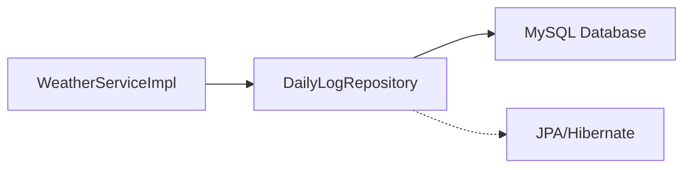
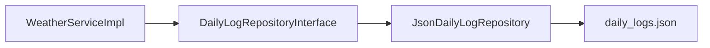

# JSON File Storage Implementation Guide

This guide will walk you through replacing MySQL database storage with a local JSON file for the `DailyLog` entity. The JSON file will only keep records from the last 30 days, automatically removing older entries.

> [!TIP]
> This implementation uses a "toggleable" approach—you'll comment out MySQL code rather than delete it, making it easy to switch back later.

---

## Table of Contents

1. [Understanding the Current Architecture](#1-understanding-the-current-architecture)
2. [Step 1: Comment Out MySQL Dependencies in pom.xml](#step-1-comment-out-mysql-dependencies-in-pomxml)
3. [Step 2: Comment Out JPA Configuration in application.yaml](#step-2-comment-out-jpa-configuration-in-applicationyaml)
4. [Step 3: Modify the DailyLog Entity](#step-3-modify-the-dailylog-entity)
5. [Step 4: Create a New JSON-Based Repository Implementation](#step-4-create-a-new-json-based-repository-implementation)
6. [Step 5: Create a Repository Interface for Toggling](#step-5-create-a-repository-interface-for-toggling)
7. [Step 6: Update WeatherServiceImpl to Use the New Repository](#step-6-update-weatherserviceimpl-to-use-the-new-repository)
8. [Step 7: Testing the Implementation](#step-7-testing-the-implementation)
9. [Reverting to MySQL](#reverting-to-mysql)

---

## 1. Understanding the Current Architecture

### Current Flow


### Target Flow


### Key Files Involved

| File | Purpose |
|------|---------|
| `pom.xml` | Maven dependencies (MySQL, JPA) |
| `application.yaml` | Database configuration |
| `DailyLog.java` | Entity class with JPA annotations |
| `DailyLogRepository.java` | JPA repository interface |
| `WeatherServiceImpl.java` | Service that uses the repository |

---

## Step 1: Comment Out MySQL Dependencies in pom.xml

**File:** `pom.xml`

You need to comment out three dependencies that enable MySQL/JPA integration.

### What to Comment Out

Find these three dependency blocks and wrap them in XML comments:

```xml
<!-- 
===========================================
MYSQL INTEGRATION - COMMENTED OUT FOR JSON STORAGE
To re-enable MySQL, uncomment these dependencies
===========================================
-->

<!-- JPA Dependency - Provides database abstraction layer
<dependency>
    <groupId>org.springframework.boot</groupId>
    <artifactId>spring-boot-starter-data-jpa</artifactId>
</dependency>
-->

<!-- JPA Test Dependency - For testing JPA repositories
<dependency>
    <groupId>org.springframework.boot</groupId>
    <artifactId>spring-boot-starter-data-jpa-test</artifactId>
    <scope>test</scope>
</dependency>
-->

<!-- MySQL Connector - JDBC driver for MySQL
<dependency>
    <groupId>com.mysql</groupId>
    <artifactId>mysql-connector-j</artifactId>
    <scope>runtime</scope>
</dependency>
-->
```

### Java Syntax Explanation: XML Comments

In XML (and thus Maven's `pom.xml`), comments use this syntax:
```xml
<!-- This is a comment -->
```

Everything between `<!--` and `-->` is ignored by Maven. You **cannot nest** XML comments, so be careful not to have `-->` inside your commented block.

---

## Step 2: Comment Out JPA Configuration in application.yaml

**File:** `src/main/resources/application.yaml`

### What to Comment Out

Comment out the entire `datasource` and `jpa` sections:

```yaml
spring:
  application:
    name: weather-board-api-service

  config:
    import: optional:file:.env[.properties]

  # ===========================================
  # MYSQL INTEGRATION - COMMENTED OUT FOR JSON STORAGE
  # To re-enable MySQL, uncomment these sections
  # ===========================================
  
  # datasource:
  #   url: ${DB_URL}
  #   username: ${DB_USERNAME}
  #   # password: ${DB_PASSWORD}

  # jpa:
  #   hibernate:
  #     ddl-auto: update
```

### YAML Syntax Explanation

In YAML, the `#` character starts a comment. Everything after `#` on that line is ignored.

---

## Step 3: Modify the DailyLog Entity

**File:** `src/main/java/com/sollo_script/weather_board_api_service/entity/DailyLog.java`

You need to **keep the class** but comment out the JPA-specific annotations. The class will become a Plain Old Java Object (POJO) that can be serialized to JSON.

### Current Code (With JPA)

```java
package com.sollo_script.weather_board_api_service.entity;

import java.time.LocalDate;

import jakarta.persistence.Column;
import jakarta.persistence.Entity;
import jakarta.persistence.GeneratedValue;
import jakarta.persistence.GenerationType;
import jakarta.persistence.Id;
import jakarta.persistence.PrePersist;
import jakarta.persistence.Table;
import lombok.AllArgsConstructor;
import lombok.Data;
import lombok.NoArgsConstructor;

@Data
@NoArgsConstructor
@AllArgsConstructor
@Table(name = "daily_calls")
@Entity
public class DailyLog {
    @Id
    @GeneratedValue(strategy = GenerationType.IDENTITY)
    private Long id;

    @Column(name = "api_name")
    private String apiName;

    @Column(name = "usage_date")
    private LocalDate usageDate;

    @Column(name = "call_count")
    private Long callCount;

    @PrePersist
    protected void onCreate() {
        this.usageDate = LocalDate.now();
    }
}
```

### Modified Code (For JSON Storage)

```java
package com.sollo_script.weather_board_api_service.entity;

import java.time.LocalDate;

// ===========================================
// MYSQL/JPA IMPORTS - COMMENTED OUT FOR JSON STORAGE
// To re-enable MySQL, uncomment these imports
// ===========================================
// import jakarta.persistence.Column;
// import jakarta.persistence.Entity;
// import jakarta.persistence.GeneratedValue;
// import jakarta.persistence.GenerationType;
// import jakarta.persistence.Id;
// import jakarta.persistence.PrePersist;
// import jakarta.persistence.Table;

import lombok.AllArgsConstructor;
import lombok.Data;
import lombok.NoArgsConstructor;

@Data
@NoArgsConstructor
@AllArgsConstructor
// ===========================================
// JPA ANNOTATIONS - COMMENTED OUT FOR JSON STORAGE
// ===========================================
// @Table(name = "daily_calls")
// @Entity
public class DailyLog {
    // ===========================================
    // JPA ID ANNOTATIONS - COMMENTED OUT
    // ===========================================
    // @Id
    // @GeneratedValue(strategy = GenerationType.IDENTITY)
    private Long id;

    // @Column(name = "api_name")
    private String apiName;

    // @Column(name = "usage_date")
    private LocalDate usageDate;

    // @Column(name = "call_count")
    private Long callCount;

    // ===========================================
    // JPA LIFECYCLE HOOK - COMMENTED OUT
    // This was automatically called before saving to DB
    // ===========================================
    // @PrePersist
    // protected void onCreate() {
    //     this.usageDate = LocalDate.now();
    // }
}
```

### Java Syntax Explanation: Annotations

**Annotations** in Java start with `@` and provide metadata about the code:

| Annotation | Purpose |
|------------|---------|
| `@Entity` | Marks this class as a JPA entity (database table) |
| `@Table(name = "...")` | Specifies the database table name |
| `@Id` | Marks this field as the primary key |
| `@GeneratedValue(...)` | Tells JPA to auto-generate the ID |
| `@Column(name = "...")` | Maps field to a specific column name |
| `@PrePersist` | Method runs automatically before saving to DB |
| `@Data` | Lombok: generates getters, setters, toString, equals, hashCode |
| `@NoArgsConstructor` | Lombok: generates a no-argument constructor |
| `@AllArgsConstructor` | Lombok: generates a constructor with all fields |

---

## Step 4: Create a New JSON-Based Repository Implementation

**New File:** `src/main/java/com/sollo_script/weather_board_api_service/repository/JsonDailyLogRepository.java`

This is the core of your implementation. This class will:
1. Read/write to a JSON file
2. Automatically remove records older than 30 days
3. Implement the same methods as the JPA repository

### Complete Implementation

```java
package com.sollo_script.weather_board_api_service.repository;

import java.io.IOException;
import java.nio.file.Files;
import java.nio.file.Path;
import java.nio.file.Paths;
import java.time.LocalDate;
import java.util.ArrayList;
import java.util.List;
import java.util.Optional;
import java.util.concurrent.atomic.AtomicLong;

import org.springframework.stereotype.Repository;

import com.sollo_script.weather_board_api_service.entity.DailyLog;

import jakarta.annotation.PostConstruct;
import tools.jackson.core.type.TypeReference;
import tools.jackson.databind.ObjectMapper;
import tools.jackson.databind.SerializationFeature;
import tools.jackson.datatype.jsr310.JavaTimeModule;

/**
 * JSON file-based repository for DailyLog entities.
 * Stores data in a local JSON file and automatically removes records older than 30 days.
 * 
 * This class replaces the JPA-based DailyLogRepository when MySQL is disabled.
 */
@Repository  // Tells Spring this is a repository bean
public class JsonDailyLogRepository {

    // =========================================
    // CONSTANTS
    // =========================================
    
    /**
     * Path to the JSON file where logs are stored.
     * The file will be created in the project root directory.
     */
    private static final String JSON_FILE_PATH = "data/daily_logs.json";
    
    /**
     * Maximum age of records in days. Records older than this will be removed.
     */
    private static final int MAX_RECORD_AGE_DAYS = 30;

    // =========================================
    // INSTANCE VARIABLES (FIELDS)
    // =========================================
    
    /**
     * Jackson ObjectMapper for JSON serialization/deserialization.
     * Jackson is a library that converts Java objects to JSON and vice versa.
     */
    private final ObjectMapper objectMapper;
    
    /**
     * Path object representing the JSON file location.
     * Path is part of java.nio.file and provides file system operations.
     */
    private final Path filePath;
    
    /**
     * Thread-safe counter for generating unique IDs.
     * AtomicLong ensures thread-safety when multiple requests happen simultaneously.
     */
    private final AtomicLong idCounter;

    // =========================================
    // CONSTRUCTOR
    // =========================================
    
    /**
     * Constructor - called by Spring when creating this bean.
     * Initializes the ObjectMapper and sets up the file path.
     */
    public JsonDailyLogRepository() {
        // Create and configure ObjectMapper
        this.objectMapper = new ObjectMapper();
        
        // Register the JavaTimeModule to handle LocalDate serialization
        // Without this, LocalDate would not serialize correctly to JSON
        this.objectMapper.registerModule(new JavaTimeModule());
        
        // Configure to write dates as readable strings, not timestamps
        // e.g., "2024-01-25" instead of [2024, 1, 25]
        this.objectMapper.disable(SerializationFeature.WRITE_DATES_AS_TIMESTAMPS);
        
        // Enable pretty printing for readable JSON output
        this.objectMapper.enable(SerializationFeature.INDENT_OUTPUT);
        
        // Set up the file path
        this.filePath = Paths.get(JSON_FILE_PATH);
        
        // Initialize ID counter to 0 (will be updated in init())
        this.idCounter = new AtomicLong(0);
    }

    // =========================================
    // INITIALIZATION
    // =========================================
    
    /**
     * Runs automatically after the constructor and dependency injection.
     * @PostConstruct is a lifecycle annotation - Spring calls this method
     * after the bean is fully constructed.
     */
    @PostConstruct
    public void init() {
        try {
            // Create the data directory if it doesn't exist
            // getParent() returns the parent directory of the file
            Path parentDir = filePath.getParent();
            if (parentDir != null && !Files.exists(parentDir)) {
                // Creates the directory and any necessary parent directories
                Files.createDirectories(parentDir);
            }
            
            // Create the JSON file with an empty array if it doesn't exist
            if (!Files.exists(filePath)) {
                // Write an empty JSON array to the file
                Files.writeString(filePath, "[]");
            }
            
            // Load existing records to determine the next ID
            List<DailyLog> existingLogs = readAllLogs();
            
            // Find the maximum existing ID and set counter to max + 1
            // This ensures new records get unique IDs
            long maxId = existingLogs.stream()
                    .filter(log -> log.getId() != null)  // Filter out nulls
                    .mapToLong(DailyLog::getId)          // Extract ID values
                    .max()                                // Find maximum
                    .orElse(0L);                         // Default to 0 if empty
            
            idCounter.set(maxId + 1);
            
            // Clean up old records on startup
            removeOldRecords();
            
        } catch (IOException e) {
            // Wrap checked exception in unchecked RuntimeException
            // This allows the exception to propagate without declaring throws
            throw new RuntimeException("Failed to initialize JSON repository", e);
        }
    }

    // =========================================
    // PUBLIC METHODS (Repository Interface)
    // =========================================
    
    /**
     * Find a DailyLog by API name and usage date.
     * This is equivalent to: SELECT * FROM daily_calls WHERE api_name = ? AND usage_date = ?
     * 
     * @param apiName The name of the API (e.g., "OpenWeather")
     * @param usageDate The date to search for
     * @return Optional containing the log if found, empty Optional otherwise
     */
    public Optional<DailyLog> findByApiNameAndUsageDate(String apiName, LocalDate usageDate) {
        // Read all logs from the JSON file
        List<DailyLog> logs = readAllLogs();
        
        // Use Java Streams to filter and find the matching record
        // This is equivalent to a loop with if statements
        return logs.stream()
                // filter() keeps only elements that match the condition
                .filter(log -> 
                    log.getApiName().equals(apiName) && 
                    log.getUsageDate().equals(usageDate))
                // findFirst() returns the first matching element as an Optional
                .findFirst();
    }
    
    /**
     * Find a single DailyLog by usage date.
     * 
     * @param today The date to search for
     * @return Optional containing the first matching log
     */
    public Optional<DailyLog> findOneByUsageDate(LocalDate today) {
        List<DailyLog> logs = readAllLogs();
        return logs.stream()
                .filter(log -> log.getUsageDate().equals(today))
                .findFirst();
    }
    
    /**
     * Find all DailyLogs for a specific date.
     * 
     * @param today The date to search for
     * @return List of all logs for that date
     */
    public List<DailyLog> findByUsageDate(LocalDate today) {
        List<DailyLog> logs = readAllLogs();
        return logs.stream()
                .filter(log -> log.getUsageDate().equals(today))
                .toList();  // Collect results into a List
    }
    
    /**
     * Save a DailyLog to the JSON file.
     * If the log has an ID, it updates the existing record.
     * If the log has no ID, it creates a new record with a generated ID.
     * Also removes records older than 30 days.
     * 
     * @param dailyLog The log to save
     * @return The saved log (with ID populated if it was new)
     */
    public DailyLog save(DailyLog dailyLog) {
        // Read current logs
        List<DailyLog> logs = readAllLogs();
        
        if (dailyLog.getId() == null) {
            // New record - generate ID
            // getAndIncrement() atomically returns current value and increments
            dailyLog.setId(idCounter.getAndIncrement());
            logs.add(dailyLog);
        } else {
            // Existing record - find and update
            boolean found = false;
            for (int i = 0; i < logs.size(); i++) {
                if (logs.get(i).getId().equals(dailyLog.getId())) {
                    logs.set(i, dailyLog);  // Replace at index i
                    found = true;
                    break;
                }
            }
            // If not found by ID, add as new
            if (!found) {
                logs.add(dailyLog);
            }
        }
        
        // Remove old records before saving
        logs = removeOldRecordsFromList(logs);
        
        // Write updated logs back to file
        writeAllLogs(logs);
        
        return dailyLog;
    }
    
    /**
     * Get all DailyLog records.
     * 
     * @return List of all logs
     */
    public List<DailyLog> findAll() {
        return readAllLogs();
    }
    
    /**
     * Delete a DailyLog by ID.
     * 
     * @param id The ID of the log to delete
     */
    public void deleteById(Long id) {
        List<DailyLog> logs = readAllLogs();
        // removeIf() removes all elements matching the predicate
        logs.removeIf(log -> log.getId().equals(id));
        writeAllLogs(logs);
    }

    // =========================================
    // PRIVATE HELPER METHODS
    // =========================================
    
    /**
     * Read all logs from the JSON file.
     * 
     * @return List of DailyLog objects (never null, may be empty)
     */
    private List<DailyLog> readAllLogs() {
        try {
            // Check if file exists and is not empty
            if (!Files.exists(filePath)) {
                return new ArrayList<>();
            }
            
            // Read the entire file content as a String
            String content = Files.readString(filePath);
            
            // Handle empty file
            if (content.isBlank()) {
                return new ArrayList<>();
            }
            
            // Deserialize JSON string to List<DailyLog>
            // TypeReference is needed because of Java's type erasure
            // It tells Jackson the exact generic type to create
            return objectMapper.readValue(content, new TypeReference<List<DailyLog>>() {});
            
        } catch (IOException e) {
            // Log the error and return empty list
            System.err.println("Error reading daily logs: " + e.getMessage());
            return new ArrayList<>();
        }
    }
    
    /**
     * Write all logs to the JSON file.
     * 
     * @param logs The list of logs to write
     */
    private void writeAllLogs(List<DailyLog> logs) {
        try {
            // Serialize List<DailyLog> to JSON string
            String jsonContent = objectMapper.writeValueAsString(logs);
            
            // Write to file (overwrites existing content)
            Files.writeString(filePath, jsonContent);
            
        } catch (IOException e) {
            throw new RuntimeException("Failed to write daily logs to JSON file", e);
        }
    }
    
    /**
     * Remove records older than MAX_RECORD_AGE_DAYS from the file.
     * Called during initialization.
     */
    private void removeOldRecords() {
        List<DailyLog> logs = readAllLogs();
        List<DailyLog> filteredLogs = removeOldRecordsFromList(logs);
        
        // Only write if something was removed
        if (filteredLogs.size() != logs.size()) {
            writeAllLogs(filteredLogs);
            System.out.println("Removed " + (logs.size() - filteredLogs.size()) + 
                    " old records from daily_logs.json");
        }
    }
    
    /**
     * Filter out records older than MAX_RECORD_AGE_DAYS from a list.
     * 
     * @param logs The list to filter
     * @return A new list containing only recent records
     */
    private List<DailyLog> removeOldRecordsFromList(List<DailyLog> logs) {
        // Calculate the cutoff date (30 days ago)
        LocalDate cutoffDate = LocalDate.now().minusDays(MAX_RECORD_AGE_DAYS);
        
        // Keep only records where usageDate is after or equal to cutoffDate
        return logs.stream()
                .filter(log -> {
                    // isBefore() returns true if this date is before the specified date
                    // We want to KEEP records that are NOT before the cutoff
                    // So we negate: !log.getUsageDate().isBefore(cutoffDate)
                    // Which means: keep if usageDate >= cutoffDate
                    return !log.getUsageDate().isBefore(cutoffDate);
                })
                .toList();
    }
}
```

### Java Syntax Explanations

#### 1. `private static final` Constants

```java
private static final String JSON_FILE_PATH = "data/daily_logs.json";
```

| Keyword | Meaning |
|---------|---------|
| `private` | Only accessible within this class |
| `static` | Belongs to the class, not instances (shared by all objects) |
| `final` | Cannot be reassigned after initialization (constant) |

**Convention:** Constants are named in `UPPER_SNAKE_CASE`.

#### 2. `Optional<T>` Type

```java
public Optional<DailyLog> findByApiNameAndUsageDate(String apiName, LocalDate usageDate)
```

`Optional` is a container that may or may not contain a value. It's used to avoid `NullPointerException`:

```java
// Without Optional (risky)
DailyLog log = findLog();  // Could be null!
log.getCallCount();        // NullPointerException if null!

// With Optional (safe)
Optional<DailyLog> optionalLog = findLog();
if (optionalLog.isPresent()) {
    DailyLog log = optionalLog.get();
    log.getCallCount();  // Safe!
}

// Or using orElseGet() for default value
DailyLog log = optionalLog.orElseGet(() -> new DailyLog());
```

#### 3. Lambda Expressions `() -> {}`

```java
.filter(log -> log.getApiName().equals(apiName))
```

Lambdas are anonymous functions. The syntax is:
```
(parameters) -> expression
(parameters) -> { statements; }
```

Examples:
```java
// Single parameter, single expression (parentheses optional)
log -> log.getApiName().equals("OpenWeather")

// Multiple parameters
(a, b) -> a + b

// Multiple statements (need braces and return)
log -> {
    String name = log.getApiName();
    return name.equals("OpenWeather");
}
```

#### 4. `AtomicLong` for Thread Safety

```java
private final AtomicLong idCounter = new AtomicLong(0);
```

Regular `long` operations are **not thread-safe**. If two requests try to increment simultaneously:
- Thread 1 reads: 5
- Thread 2 reads: 5
- Thread 1 writes: 6
- Thread 2 writes: 6 ← **WRONG! Should be 7!**

`AtomicLong` uses hardware-level atomic operations to prevent this.

#### 5. Stream API

```java
logs.stream()
    .filter(log -> log.getUsageDate().equals(today))
    .findFirst();
```

Streams provide a functional way to process collections:

| Method | Purpose |
|--------|---------|
| `stream()` | Convert collection to a stream |
| `filter()` | Keep only elements matching condition |
| `map()` | Transform each element |
| `findFirst()` | Get first element as Optional |
| `toList()` | Collect results into a List |
| `mapToLong()` | Extract long values from objects |
| `max()` | Find maximum value |

#### 6. `@PostConstruct` Lifecycle Annotation

```java
@PostConstruct
public void init() {
```

This annotation marks a method to run **after** the constructor and dependency injection are complete, but **before** the bean is used. Perfect for initialization that needs all dependencies ready.

---

## Step 5: Create a Repository Interface for Toggling

**Optional but Recommended**

To make switching between MySQL and JSON easier, you can create an interface that both repositories implement.

**New File:** `src/main/java/com/sollo_script/weather_board_api_service/repository/DailyLogRepositoryInterface.java`

```java
package com.sollo_script.weather_board_api_service.repository;

import java.time.LocalDate;
import java.util.List;
import java.util.Optional;

import com.sollo_script.weather_board_api_service.entity.DailyLog;

/**
 * Common interface for DailyLog repository implementations.
 * Allows switching between JPA (MySQL) and JSON file storage.
 */
public interface DailyLogRepositoryInterface {
    
    Optional<DailyLog> findOneByUsageDate(LocalDate today);
    
    List<DailyLog> findByUsageDate(LocalDate today);
    
    Optional<DailyLog> findByApiNameAndUsageDate(String apiName, LocalDate usageDate);
    
    DailyLog save(DailyLog dailyLog);
    
    List<DailyLog> findAll();
    
    void deleteById(Long id);
}
```

Then update `JsonDailyLogRepository` to implement this interface:

```java
@Repository
public class JsonDailyLogRepository implements DailyLogRepositoryInterface {
    // ... rest of the implementation
}
```

---

## Step 6: Update WeatherServiceImpl to Use the New Repository

**File:** `src/main/java/com/sollo_script/weather_board_api_service/service/impl/WeatherServiceImpl.java`

### Changes Required

1. Update the import statement
2. Change the repository field type
3. Update the constructor

### Updated Code

```java
package com.sollo_script.weather_board_api_service.service.impl;

import java.time.LocalDate;
import java.util.List;
import java.util.Optional;

import lombok.NonNull;
import org.springframework.beans.factory.annotation.Qualifier;
import org.springframework.beans.factory.annotation.Value;
import org.springframework.core.ParameterizedTypeReference;
import org.springframework.stereotype.Service;
import org.springframework.web.client.RestClient;

import com.sollo_script.weather_board_api_service.dto.AirPollutionResponse;
import com.sollo_script.weather_board_api_service.dto.GeocodeResponse;
import com.sollo_script.weather_board_api_service.dto.OpenWeatherResponse;
import com.sollo_script.weather_board_api_service.entity.DailyLog;
import com.sollo_script.weather_board_api_service.exception.error.TooManyRequestsException;

// ===========================================
// MYSQL/JPA IMPORT - COMMENTED OUT
// ===========================================
// import com.sollo_script.weather_board_api_service.repository.DailyLogRepository;

// ===========================================
// JSON FILE STORAGE - ACTIVE
// ===========================================
import com.sollo_script.weather_board_api_service.repository.JsonDailyLogRepository;

import com.sollo_script.weather_board_api_service.service.WeatherService;

import tools.jackson.databind.ObjectMapper;

@Service
public class WeatherServiceImpl implements WeatherService {

    @Value("${openweathermap.api.apikey}")
    private String internalApiKey;

    // ===========================================
    // MYSQL/JPA REPOSITORY - COMMENTED OUT
    // ===========================================
    // private final DailyLogRepository dailyLogRepository;
    
    // ===========================================
    // JSON FILE REPOSITORY - ACTIVE
    // ===========================================
    private final JsonDailyLogRepository dailyLogRepository;

    private final RestClient openWeatherRestClient;
    private final RestClient openWeatherTileRestClient;

    public WeatherServiceImpl(
            // ===========================================
            // MYSQL/JPA - COMMENTED OUT
            // DailyLogRepository apiLogRepository,
            // ===========================================
            
            // JSON FILE STORAGE - ACTIVE
            JsonDailyLogRepository apiLogRepository,
            
            @Qualifier("openWeatherMap") RestClient openWeatherClient,
            @Qualifier("openWeatherMapTile") RestClient openWeatherMapTileClient) {
        this.dailyLogRepository = apiLogRepository;
        this.openWeatherRestClient = openWeatherClient;
        this.openWeatherTileRestClient = openWeatherMapTileClient;
    }

    // ... rest of the class remains unchanged
}
```

> [!IMPORTANT]
> The `fetchDayLog()` method and `save()` calls **do not need to change** because `JsonDailyLogRepository` has the same method signatures as the JPA repository.

---

## Step 7: Testing the Implementation

### Build and Run

```bash
# Clean and rebuild the project
./mvnw clean compile

# Run the application
./mvnw spring-boot:run
```

### Verify the JSON File

After making some API calls, check that the file was created:

```bash
# View the contents of the JSON file
cat data/daily_logs.json
```

You should see something like:

```json
[
  {
    "id": 1,
    "apiName": "OpenWeather",
    "usageDate": "2024-01-25",
    "callCount": 5
  }
]
```

### Test the 30-Day Cleanup

To verify old records are removed, you can manually edit the JSON file to add an old date:

```json
[
  {
    "id": 1,
    "apiName": "OpenWeather",
    "usageDate": "2023-11-01",
    "callCount": 100
  },
  {
    "id": 2,
    "apiName": "OpenWeather",
    "usageDate": "2024-01-25",
    "callCount": 5
  }
]
```

Restart the application, and the old record should be automatically removed.

---

## Reverting to MySQL

To switch back to MySQL:

1. **Uncomment** the dependencies in `pom.xml`
2. **Uncomment** the datasource and jpa sections in `application.yaml`
3. **Uncomment** the JPA annotations in `DailyLog.java`
4. **Update** `WeatherServiceImpl.java` to use `DailyLogRepository` instead of `JsonDailyLogRepository`

---

## Summary of Files Changed/Created

| File | Action |
|------|--------|
| `pom.xml` | Comment out MySQL/JPA dependencies |
| `application.yaml` | Comment out datasource/jpa config |
| `DailyLog.java` | Comment out JPA annotations |
| `DailyLogRepository.java` | Keep but not used (for reverting) |
| `JsonDailyLogRepository.java` | **NEW** - Create this file |
| `DailyLogRepositoryInterface.java` | **NEW** (Optional) - Interface for toggling |
| `WeatherServiceImpl.java` | Update repository type |

---

## Appendix: Alternative Toggle Approach Using Spring Profiles

For a more dynamic toggle without code changes, you can use **Spring Profiles**:

### application.yaml

```yaml
spring:
  profiles:
    active: json  # Change to "mysql" to switch back
```

### Create Profile-Specific Configs

**application-json.yaml:**
```yaml
# No datasource config needed
```

**application-mysql.yaml:**
```yaml
spring:
  datasource:
    url: ${DB_URL}
    username: ${DB_USERNAME}
```

### Conditional Repository Beans

```java
@Repository
@Profile("json")  // Only active when profile is "json"
public class JsonDailyLogRepository implements DailyLogRepositoryInterface {
    // ...
}
```

This way, you just change `spring.profiles.active` to switch between implementations!
